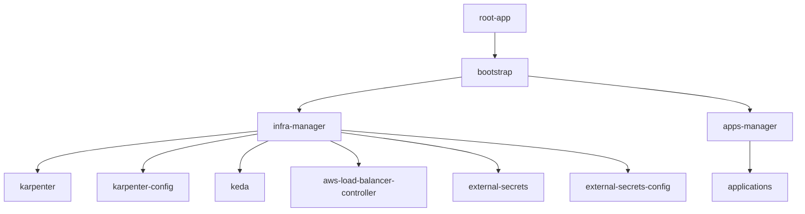

# Infra GitOps

Este repositório contém a configuração GitOps para gerenciar a infraestrutura Kubernetes usando ArgoCD.

## 📁 Estrutura do Projeto

```
infra-gitops/
├── apps/                                 # Applicationsets ["app-x/appset.yaml"] e subdiretórios ["app-x/values/dev.yaml"] com os Values das aplicações
├── bootstrap/                            # Applications e Projects
│   ├── projects/                         # Projetcs do ArgoCD
│   └────── hands-on.yaml                 # Project Hands-on para testes
│   ├── management/                       # Applications de bootstrap (App of Apps)
│   └────── apps-manager.yaml             # Aponta para apps/
│   └────── infra-manager.yaml            # Aponta para infra-base/
├── infra-base/                           # Componentes de infraestrutura
│   ├── aws-load-balancer-controller.yaml # AppSet do AWS LBC
│   ├── external-secrets.yaml             # AppSet do External Secrets Operator
│   ├── external-secrets-config.yaml      # AppSet da config do External Secrets
│   ├── karpenter.yaml                    # ApplicationSet do controller Karpenter
│   ├── karpenter-config.yaml             # ApplicationSet da config do Karpenter
│   └── keda.yaml                         # ApplicationSet do KEDA
├── infra-config/                         # Charts locais e configurações
│   ├── external-secrets/                 # Chart local para ClusterSecretStore
│   └── karpenter/                        # Chart local para NodePool/EC2NodeClass
└── root-app/                             # Ponto de entrada
    └── app.yaml                          # Aponta para bootstrap/
```

## 🚀 Como Funciona

Este projeto segue o padrão **App of Apps** do ArgoCD:



1. **root-app**: Ponto de entrada que aponta para o diretório `bootstrap/`.
2. **bootstrap/**: Contém as Applications que gerenciam `infra-base/` e `apps/`.
3. **infra-base/**: Contém ApplicationSets para componentes de infraestrutura.
4. **apps/**: Contém ApplicationSets para aplicações de negócio.

## 🎯 Boas Práticas ArgoCD Implementadas

| Prática | Status | Descrição |
|---------|--------|-----------|
| App of Apps | ✅ | Estrutura hierárquica para gerenciar múltiplas applications |
| ApplicationSets | ✅ | Deployments multi-cluster/ambiente |
| Sync Waves | ✅ | Ordenação de deployments (controller antes da config) |
| Automated Sync | ✅ | `prune: true` e `selfHeal: true` |
| CreateNamespace | ✅ | Criação automática de namespaces |
| ServerSideApply | ✅ | Para CRDs e recursos complexos |
| Separação de Concerns | ✅ | Infraestrutura separada de aplicações |

## 📦 Componentes

### Karpenter

O [Karpenter](https://karpenter.sh/) é um provisionador de nós para Kubernetes que automatiza o scaling.

**ApplicationSets:**
- `karpenter.yaml`: Instala o controller do Karpenter via Helm chart OCI.
- `karpenter-config.yaml`: Aplica as configurações (`NodePool` e `EC2NodeClass`) a partir de `infra-config/karpenter`.

### AWS Load Balancer Controller

O [AWS Load Balancer Controller](https://kubernetes-sigs.github.io/aws-load-balancer-controller/) gerencia ALBs e NLBs na AWS.

**ApplicationSets:**
- `aws-load-balancer-controller.yaml`: Instala o controller via Helm chart oficial.

### External Secrets Operator

O [External Secrets Operator](https://external-secrets.io/) sincroniza segredos de provedores externos (AWS Secrets Manager) para o Kubernetes.

**ApplicationSets:**
- `external-secrets.yaml`: Instala o Operator via Helm chart oficial.
- `external-secrets-config.yaml`: Instala o `ClusterSecretStore` a partir de `infra-config/external-secrets`.

## 🔧 Como Adicionar um Novo Cluster

### Para Karpenter
Edite `infra-base/karpenter.yaml` e `infra-base/karpenter-config.yaml` adicionando o novo cluster na lista de generators.

### Para AWS Load Balancer Controller
Edite `infra-base/aws-load-balancer-controller.yaml` e adicione o novo cluster com seu respectivo `vpc_id`.

### Para External Secrets
Edite `infra-base/external-secrets.yaml` e `infra-base/external-secrets-config.yaml` (especificando a `region` se necessário).
