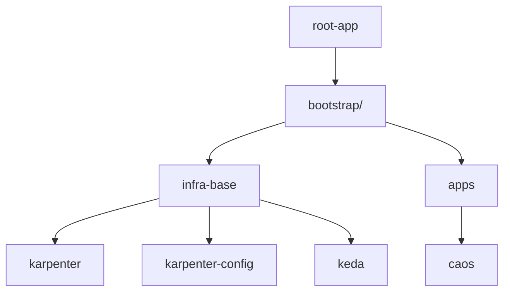

# Infra GitOps

Este repositório contém a configuração GitOps para gerenciar a infraestrutura Kubernetes usando ArgoCD.

## 📁 Estrutura do Projeto

```
infra-gitops/
├── apps/                          # Deployments de aplicações
│   └── caos.yaml                  # ApplicationSet para app caos
├── bootstrap/                     # Applications de bootstrap (App of Apps)
│   ├── apps.yaml                  # Aponta para apps/
│   └── infra-base.yaml            # Aponta para infra-base/
├── infra-base/                    # Componentes de infraestrutura
│   ├── config/
│   │   └── karpenter/             # CRDs do Karpenter (Helm chart)
│   │       ├── Chart.yaml
│   │       ├── default-ec2nodeclass.yaml
│   │       └── nodepool.yaml
│   ├── karpenter.yaml             # ApplicationSet do controller Karpenter
│   ├── karpenter-config.yaml      # ApplicationSet da config do Karpenter
│   └── keda.yaml                  # ApplicationSet do KEDA
└── root-app/                      # Ponto de entrada
    └── app.yaml                   # Aponta para bootstrap/
```

## 🚀 Como Funciona

Este projeto segue o padrão **App of Apps** do ArgoCD:



1. **root-app**: Ponto de entrada que aponta para o diretório `bootstrap/`.
2. **bootstrap/**: Contém as Applications que gerenciam `infra-base/` e `apps/`.
3. **infra-base/**: Contém ApplicationSets para componentes de infraestrutura (Karpenter, KEDA).
4. **apps/**: Contém ApplicationSets para aplicações de negócio.

## 🎯 Boas Práticas ArgoCD Implementadas

| Prática | Status | Descrição |
|---------|--------|-----------|
| App of Apps | ✅ | Estrutura hierárquica para gerenciar múltiplas applications |
| ApplicationSets | ✅ | Deployments multi-cluster/ambiente |
| Sync Waves | ✅ | Ordenação de deployments (controller antes da config) |
| Automated Sync | ✅ | `prune: true` e `selfHeal: true` |
| CreateNamespace | ✅ | Criação automática de namespaces |
| ServerSideApply | ✅ | Para CRDs e recursos complexos |
| Separação de Concerns | ✅ | Infraestrutura separada de aplicações |

## 📦 Componentes

### Karpenter

O [Karpenter](https://karpenter.sh/) é um provisionador de nós para Kubernetes que automatiza o scaling.

**ApplicationSets:**
- `karpenter.yaml`: Instala o controller do Karpenter via Helm chart OCI.
- `karpenter-config.yaml`: Aplica as configurações (`NodePool` e `EC2NodeClass`).

**Sync Waves:**
- Wave 0: Controller do Karpenter
- Wave 1: Configuração (`NodePool` + `EC2NodeClass`)

### KEDA

O [KEDA](https://keda.sh/) é um autoscaler baseado em eventos para Kubernetes.

**ApplicationSet:**
- `keda.yaml`: Instala o KEDA em clusters com label `keda: "true"`.

## 🔧 Como Adicionar um Novo Cluster

### Para Karpenter

1. Edite `infra-base/karpenter.yaml` e adicione um novo elemento no generator:

```yaml
generators:
- list:
    elements:
    - name: dev-demo
      server: https://kubernetes.default.svc
      role_arn: arn:aws:iam::ACCOUNT:role/KarpenterController-XXX
      queue_name: Karpenter-dev-demo
      revision: 1.8.2
    - name: prod-cluster  # Novo cluster
      server: https://ENDPOINT
      role_arn: arn:aws:iam::ACCOUNT:role/KarpenterController-YYY
      queue_name: Karpenter-prod-cluster
      revision: 1.8.2
```

2. Edite `infra-base/karpenter-config.yaml` para adicionar a configuração do novo cluster.

### Para KEDA

1. Adicione o cluster no ArgoCD com a label `keda: "true"`:

```bash
argocd cluster add CLUSTER_NAME --label keda=true
```

## 📋 Pré-requisitos AWS para Karpenter

Antes de implantar o Karpenter, certifique-se de ter:

1. **IAM Role para o Controller**: Com permissões para EC2, SQS, etc.
2. **IAM Role para os Nodes**: Com política `AmazonEKSWorkerNodePolicy`.
3. **SQS Queue**: Para interrupção de instâncias Spot.
4. **Tags nas Subnets e Security Groups**: `karpenter.sh/discovery: <cluster-name>`.

## 🔄 Deploy Inicial

1. Aplique a root-app:

```bash
kubectl apply -f root-app/app.yaml
```

2. O ArgoCD irá sincronizar automaticamente:
   - `bootstrap/` → `infra-base/` e `apps/`
   - `infra-base/` → Karpenter, KEDA, etc.
   - `apps/` → Aplicações
