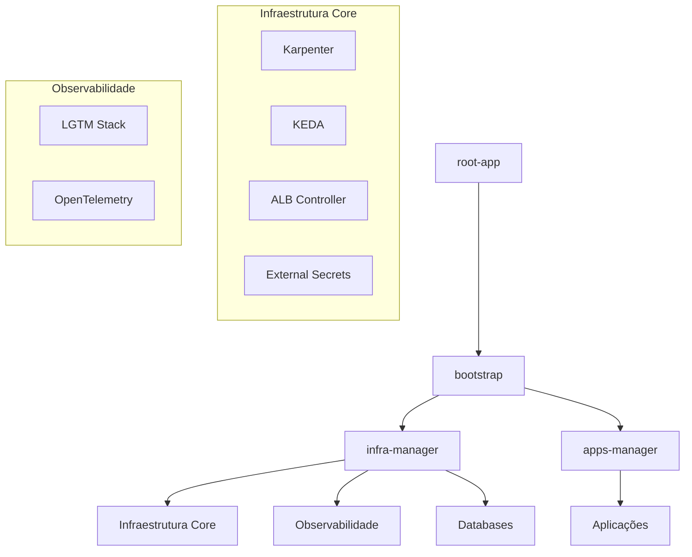

# Infra GitOps

Este repositório gerencia a infraestrutura Kubernetes e aplicações através do ArgoCD, seguindo o padrão **App of Apps**.

## 📁 Estrutura do Projeto

```text
infra-gitops/
├── apps/           # Configurações e valores das aplicações de negócio
├── bootstrap/      # Projetos e Applications de gerenciamento (App of Apps)
├── infra-base/     # Manifestos (ApplicationSets) dos componentes de infraestrutura
├── infra-config/   # Helm Charts locais para configurações customizadas
└── root-app/       # Ponto de entrada que inicializa todo o ecossistema
```

## 🚀 Fluxo de Deployment



## 📦 Componentes de Infraestrutura

Os componentes estão organizados por categorias funcionais no diretório `infra-base/`:

- **Compute & Scaling**: [Karpenter](https://karpenter.sh/) para auto-scaling de nós e [KEDA](https://keda.sh/) para auto-scaling baseado em eventos.
- **Networking**: [AWS Load Balancer Controller](https://kubernetes-sigs.github.io/aws-load-balancer-controller/) para gerenciamento de ALBs e NLBs.
- **Security**: [External Secrets Operator](https://external-secrets.io/) para integração com AWS Secrets Manager.
- **Database**: Gerenciamento de instâncias [MongoDB](https://www.mongodb.com/) via Helm.
- **Observability**: Stack completa composta por **Grafana, Prometheus, Loki e Tempo** (LGTM), além do **OpenTelemetry Operator/Collector** para instrumentação e coleta de telemetria.

## 🔧 Manutenção e Expansão

### Adicionar Novos Ambientes ou Clusters
Para adicionar um novo cluster ou ambiente, localize o `ApplicationSet` do componente desejado em `infra-base/` e atualize a lista de `generators`.

### Boas Práticas Implementadas
- **Sync Waves**: Ordenação automática (ex: controllers antes de configurações).
- **Auto-healing**: `prune` e `selfHeal` habilitados para evitar derivação de configuração.
- **Server-side Apply**: Utilizado para gerenciar CRDs e recursos complexos.
